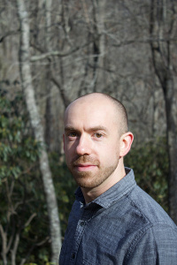

# About me  
  
My undergraduate work was in political theory and international relations at Michigan State University. There, I worked on a senior thesis analyzing digital media from the perspective of liberal political theory in which I asked in what ways we might need to re-envision the classical liberal tradition in light of changing, porous definitions and practices of privacy, property, and personal interaction. After Michigan State, I completed a Master of Divinity at Yale Divinity School. I am now in my third full semester (plus a summer course) of the MSc program in Computer Science here at New Paltz, and working as a full TA teaching CS2 labs. My interests are primarily in server-side web/mobile programming, and in machine learning and AI. I have taken classes here in Programming & Data Structures, Computer Systems, Database Design, Machine Learning, Algorithms, Data Analysis, and E-Business. I have written a data collection program that collects data from the Twitter API, does some processing of that data, and stores it in a MySQL database (this was a database design project that I also extended on my own). I have added a front-end data visualization component to this web app as well (originally using Dash, a Python library that makes use of React). For an e-business project I created a data collection API integrating with other systems using a Java socket program, with the main program running CGI written in Python for an Apache server, using plain HTML and CSS on the front-end, for the public-facing portion of the system. I’ve also done some tinkering with Android programming in Java recently. I have some basic exposure to MongoDB, Express, Flask, Django, Bootstrap, Vega-Lite (and Altair, a Python wrapper for it), React, and .NET in C# through online tutorials and associated tinkering on my own.  

I hope to gain from this class a more complete and professionalized sense of how to program for the web (and to some extent perhaps by analogy to program for mobile applications), which is something I have some experience with both from personal projects and from an e-business class last semester. I see myself using these skills in two primary ways: the first is that I plan to work in back-end development after graduating in May. The second is that I have a variety of personal web programming projects I would like to work on, and want to gain as much experience as possible writing not only functional but also _good_ code.
